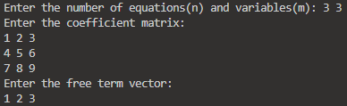
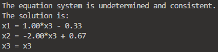

# System Solver

## Overview

This is an university assignment to compute the solution of a linear
system of equations using Montante's method(Bareiss Algorithm).

The input method is taken from stdin, the algorithm prints 
the output in a human readable way if the system is consistent, else it just 
says that the system is incosistent, since there is no solution.

## Dependencies

- make

## Screenshots



## Usage

First build the project using make.

```
cd system-solver
make
```

Then you can just launch the exe, where you can enter the coefficient matrix,
then the free terms vector, and the program will compute the result.


